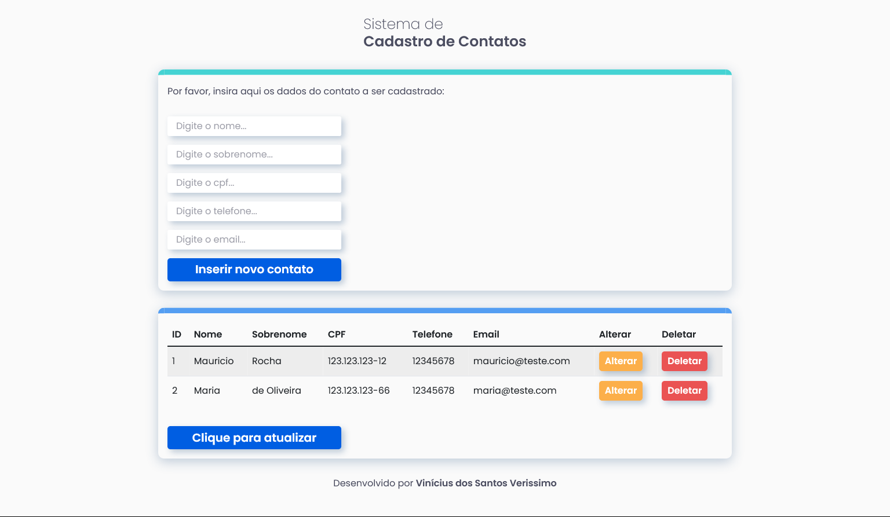

# Contact Registration Application using NodeJS, Express and MySQL for the back-end and React in the front-end

## Overview

### Screenshot

## My proccess

### Built with

-   NodeJS
-   Express
-   MySQL
-   HTML5
-   CSS3
-   JavaScript
-   React
-   Axios

### How to use

Firstly, open the terminal and execute 'cd server/' to select the server folder, after that execute 'npm install' to install de necessary dependencies.

After that, execute 'node index.js' on the terminal to start the server;

Then, open another terminal, travel to the 'client' folder and execute 'npm install' to install the dependencis used by the client-side.

To open the application on the browser, execute 'npm start' on the terminal opened in the 'client' folder.

The application have two areas, the first one with inputs to insert a new contact, and another one with a table where are going to be shown the data stored in the database.

The first area have inputs that are going to validate the data when the user clicks on the button 'Inserir novo contato', printing instructions to correct the inserted information.

On the other hand, the second area have a table that is going to be filled with the data stored in the database by the moment the user clicks on the button 'Clique aqui para atualizar'.

In this area, to each line there are two buttons, one to change and another one to delete data.

After clicking on the button 'Alterar', the application is going to open a modal with inputs to be changed, with the options of confirm or cancel the modification.

Finally, by clicking the button 'Deletar', the database is going to change the 'deletado' field of the line to 'true' and it is not going to be shown anymore on the contacts table due to the 'WHERE' condition inserted on the command 'SELECT \* FROM contatos'.

By doing that, the registry is going to persist even after its exclusion.

To attend the General Personal Data Protection Law, nº 13.709, it is possible to change this funcionality to replace all the registry's data to "".

To work, the computer should have MySQL installed, with the user "root", host "localhost" and password "".

## Author

-   GitHub - Vinícius dos Santos Verissimo (https://github.com/viniciusdsv93)
