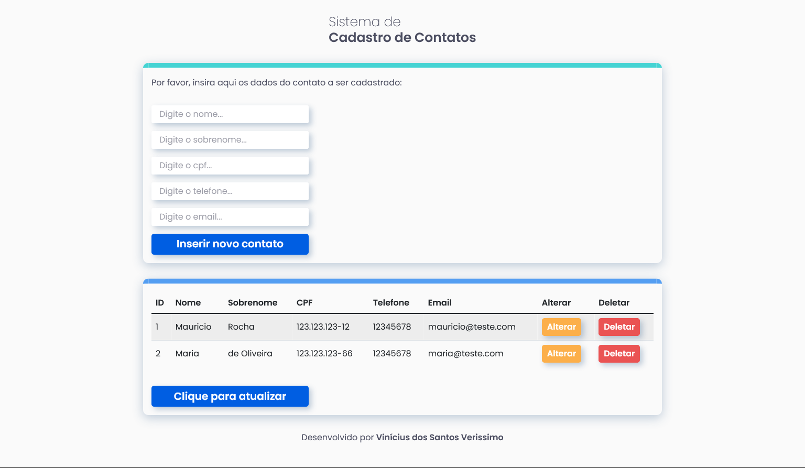

# Aplicação de Cadastro de Contatos usando NodeJS, Express e MySQL no back-end e React no front-end

## Visão Geral

### Screenshot

## Meu processo

### Construído com

-   NodeJS
-   Express
-   MySQL
-   HTML5
-   CSS3
-   JavaScript
-   React
-   Axios

### Como utilizar

Inicialmente, abra o terminal e execute o comando 'cd server/' para selecionar a pasta de servidor, depois disso execute 'npm install' para instalar as dependências necessárias.

Após isso, execute a instrução 'node index.js' no terminal para iniciar o servidor.

Então, abra outro terminal, navegue até a pasta 'client' e execute 'npm install' para instalar as dependências utilizadas pelo client-side.

Para abrir a aplicação, execute 'npm start' no terminal aberto na pasta 'client'.

A aplicação possui duas áreas, a primeira com inputs para inserir um novo contato, e outra com uma tabela onde serão inseridos os dados salvos no banco de dados.

A primeira área contém inputs que irão validar as informações inseridas no momento em que o usuário clicar no botão de 'Inserir novo contato', exibindo instruções para corrigir os dados passados.

Por sua vez, a segunda área contém uma tabela que será preenchida com os dados armazenados no banco de dados no momento em que o usuário clicar no botão 'Clique para atualizar'.

Nesta área, para cada linha existem dois botões, um para alterar e outro para deletar os dados.

Ao clicar no botão 'Alterar', será aberto um modal com inputs a serem modificados, com as opções de confirmar ou cancelar a alteração.

Por fim, ao clicar no botão 'Deletar', o banco de dados alterará o campo 'deletado' do registro para 'true' e ele não será mais exibido na tabela de contatos por conta da condição 'WHERE' inserida no comando 'SELECT \* FROM contatos'.

Dessa forma, o registro persistirá mesmo depois de sua exclusão.

Para atender a Lei Geral de Proteção de Dados Pessoais, Lei nº 13.709, é possível modificar essa funcionalidade para substituir todos os dados do registro para "".

Para funcionar, o computador deve ter o MySQL instalado, com o user "root", host "localhost" e password "".

## Autor

-   GitHub - Vinícius dos Santos Verissimo (https://github.com/viniciusdsv93)
